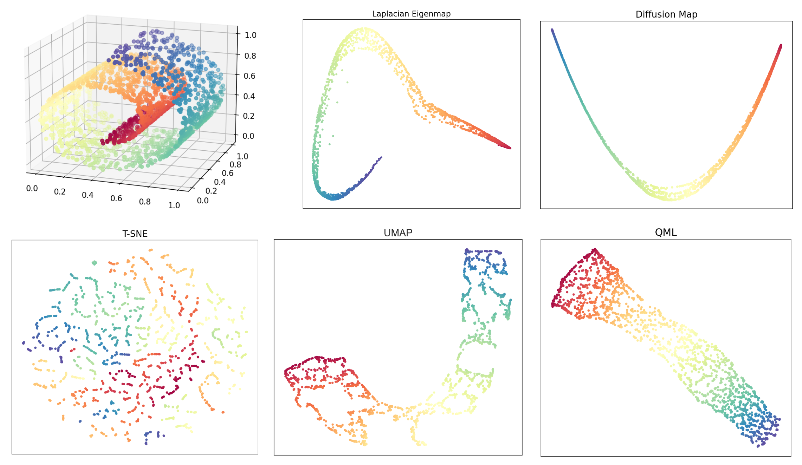
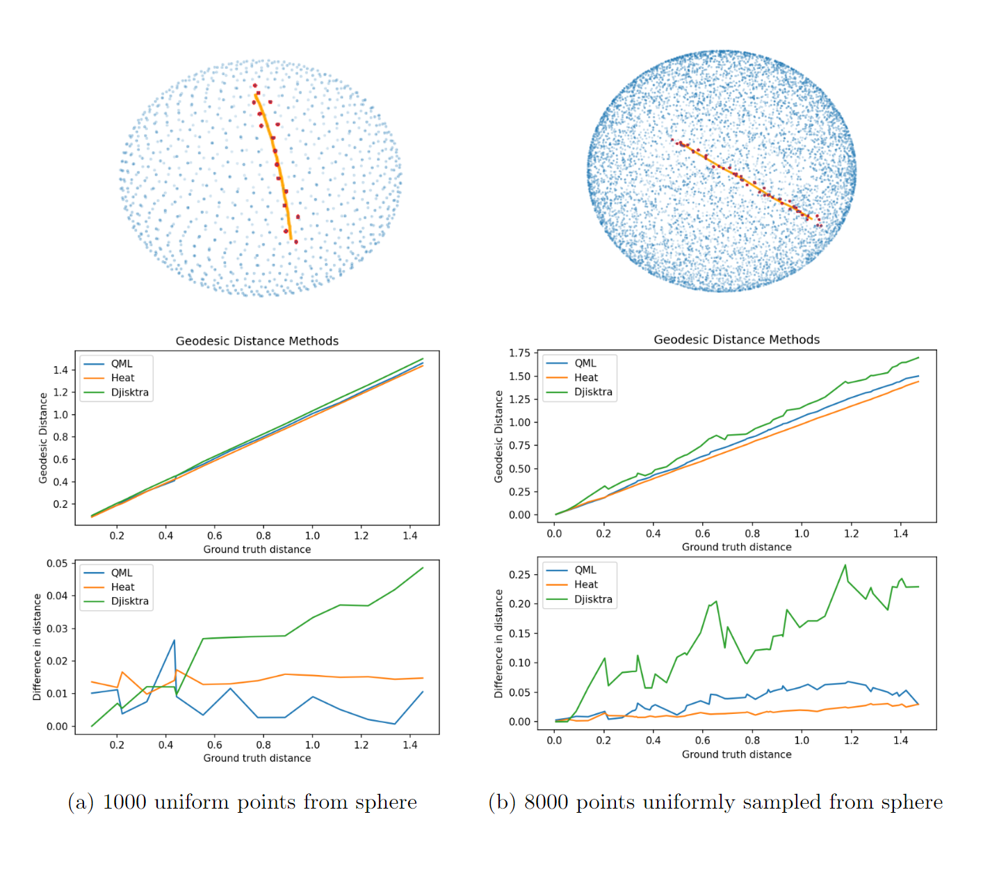

[](https://github.com/sandialabs/sbovqaopt/actions/workflows/python-package.yml)

# QML: Implementation of quantum manifold learning (QML)

The `QML` package provides an implementation of manifold learning via quantum dynamics as introduced in [arXiv:2112.11161](https://arxiv.org/abs/2112.11161). This is an implementation without any parallelization.

## Installation

The `QML` package only consists of one file qml_serial.py, which contains all functions required.

## Usage

The QML code is executed on data stored in a CSV, h5, sql, xlsx, or json file. The data must just store a matrix as more complex formats are not processed.
The code is called with a input file that specifies all parameters, e.g.,

```
python3 qml_serial.py QML_test_input.data
```

For an example input file and required parameters see `QML_test_input.dat`. Some useful parameters are described below. For a full discribtion refer to psuedocode in Appendix VI of [arXiv:2112.11161](https://arxiv.org/abs/2112.11161) for interpretation of code and parameters.

* `logepsilon` : This is an error term for scaling parameters used in constructing the graph Laplacian.
* `alpha` : This scales with `logepsilon` to determine the error term "h". This term bounds the error on the geodesics found through propagation.
* `dt` : Determines time step size for propagating geodesics. Paths are found at an unit speed, so time step is equivilant to distance.
* `nProp` : Number of time steps taken. Taking more steps along geodesics increase the number of paths found between points as more distance is covered.
* `nColl` : Number of initial momenta for geodesics. Each starting momentum start is a direction towards its "nColl" nearest neighbors. Increasing this parameter will start the propagation in more directions.
* `H_test` : Boolean to autmatically tune error terms. The optimal values may not be the minimum found from this test, but it often close to the minimum.

The outputs of QML are:
    - Saves geodesic distance matrix to file "f.out", where "f" is the input file name
    - Optionally, also plots an embedding of the graph if SHOW_EMBEDDING = 2 or 3 (this number sets the embedding dimension) in the input file

## Development

For development purposes, the package can be obtained by cloning the repository locally:

```
git clone https://github.com/sandialabs/QML.git
```

## Manfold learning comparison
For the [Swissroll dataset](https://scikit-learn.org/stable/modules/generated/sklearn.datasets.make_swiss_roll.html) of 2000 points, QML outperforms other manifold learning techniques when [2](#citations) is used for graph embedding. QML works by approximating the Hamiltonian dynamics of the dataset. Using this diffusion process, a wavepacket can be propagated to find the geodesic distance between points. This creates a local graph of the data that can be embedded, giving a low-dimensional representation. Other methods function similarly. UMAP constructs a local graph and optimizes graph embedding. Laplacian eigenmaps and diffusion maps find low-dimensional representations from the eigenvectors of local distance graphs obtained by Euclidean distance or a diffusion process, respectively.
UMAP, local graph approximation, graph embedding optimization. t-SNE works by finding probabilistic similarities between points and finds a representation that minimizes the divergence of the found probability distributions.  
<!---
For the [swissroll data set](https://scikit-learn.org/stable/modules/generated/sklearn.datasets.make_swiss_roll.html) of 2000 points QML out performs other manifold learning techniques when [2](#citations) is used for graph embedding. QML works by approximating the Halmintonian dynamics of the dataset. Using this diffusion process a wavepacket can be propagated to find the geodesic distance between points. This creates a local graph of the data that can be embedded giving a low dimensional representation. Other methods function similarly. UMAP constructs a local graph and optimizes a graph embedding. Laplacian eigenmaps and diffusion maps find low dimensional representations from the eigenvectors of local distance graphs obtained by euclidean distance or a diffusion process respectivly.
UMAP, local graph approximation, graph embedding optimization. T-SNE works by finding probablistic similaries between points and finds a representation that minimized the divergence of the found probability distributions.  -->
  
<!--- On the swiss roll of 2000 uniformly sampled points QML, UMAP, Laplacian eigenmaps, and diffusion maps all manage to unroll the data onto a 2D manifold. QML and UMAP retain information along the dimension of initally flat dimension of the data. While only QML mantains a uniform distirbution of the data and manages to straighten swiss roll, while all others are curved.-->
On the Swiss roll with 2000 uniformly sampled points, QML, UMAP, Laplacian eigenmaps, and diffusion maps all succeed in unrolling the data onto a 2D manifold. QML and UMAP retain information along the initially flat dimension of the data. However, only QML maintains a uniform distribution of the data and manages to straighten the Swiss roll, while all the others result in a curved representation.


<p align="center">
    
</p>

## Geodesic method comparison

<!--- Quantum Manifold Learning (QML) computes geodesics using a diffusion process derived from quantum dynamics. The accuracy of the geodesics scales with the amount of data in the input. QML scales to higher-dimensional data more efficiently than common geodesic methods. Others methods compared agianst here are the heat method [3](#citations) and shortest paths on local graphs. The heat method works by solving the heat equation on the data set and scaling the output to match a distance metric. Djikstra's algorithm can also be used on a neirest neighbors graph of euclidean distances to approximate geodesic distance. 
   
When applied to samplings of the sphere, geodesics are recovered with similar accuracy to the heat method. Both methods outperform distances obtained from using Dijkstra's method on a nearest neighbor graph of degree 6. Additionally QML can output a geodesic path show on the top of the figure. This is constructed from propagating for multiple time steps and plotting the position along the way. -->

Quantum Manifold Learning (QML) computes geodesics using a diffusion process derived from quantum dynamics. The accuracy of the geodesics scales with the amount of data in the input. QML scales to higher-dimensional data more efficiently than common geodesic methods. Other methods compared here are the heat method [3](#citations) and shortest paths on local graphs. The heat method works by solving the heat equation on the dataset and scaling the output to match a distance metric. Dijkstra's algorithm can also be used on a nearest neighbors graph of Euclidean distances to approximate geodesic distance.

When applied to samplings of the sphere, geodesics are recovered with similar accuracy to the heat method. Both methods outperform distances obtained from using Dijkstra's method on a nearest neighbor graph of degree 6. Additionally, QML can output a geodesic path shown on top of the figure. This is constructed by propagating for multiple time steps and plotting the position along the way

<p align="center">
    
</p>

## Citations

If you use or refer to this project in any publication, please cite the corresponding paper:

> 1. Akshat Kumar, Mohan Sarovar. _Manifold learning via quantum dynamics._ [arXiv:2112.11161](https://arxiv.org/abs/2112.11161) (2022).

> 2. Peter Oostema, Franz Franchetti. _Leveraging High Dimensional Spatial Graph Embedding as a Heuristic for Graph Algorithms._ [ieeexplore.ieee.org](https://spiral.ece.cmu.edu/pub-spiral/pubfile/PDCO2021_338.pdf) (2021).

> 3. Keenan Crane, Clarisse Weischedel, Max Wardetzky. _The Heat Method for Distance Computation_ [ACM](https://www.cs.cmu.edu/~kmcrane/Projects/HeatMethod/paperCACM.pdf)